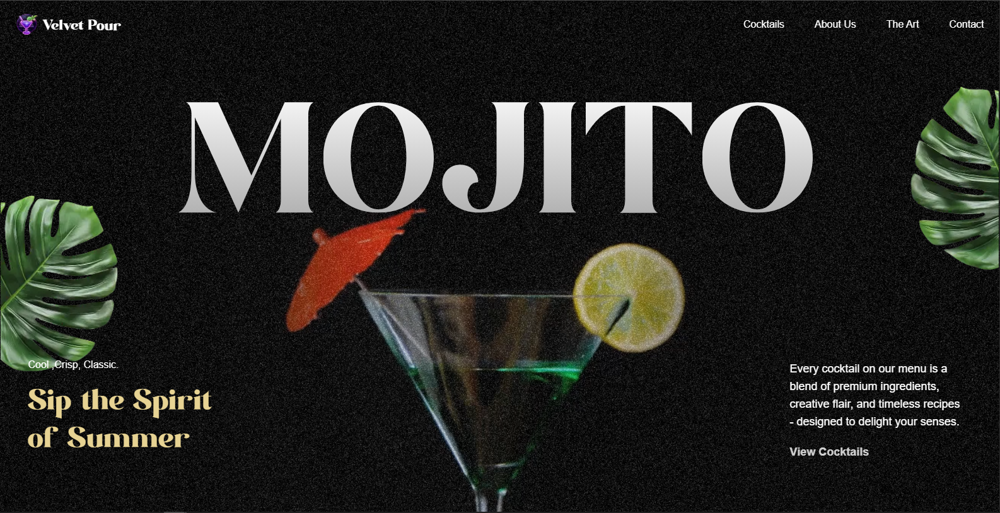

# 🍹 Velvet Pour - Mojito Cocktail Bar

<div align="center">
  
  
  [](https://mojito-cocktail-seven.vercel.app/)
  [](https://nextjs.org/)
  [](https://www.typescriptlang.org/)
  [](https://tailwindcss.com/)
</div>

##  About

**Velvet Pour** is a modern, elegant cocktail bar website showcasing the finest mojito cocktails and premium beverages. Built with Next.js 15 and TypeScript, this responsive web application features smooth animations, beautiful UI design, and an immersive user experience that captures the essence of a premium cocktail bar.

###  Key Features

- **Modern UI/UX Design** - Clean, elegant interface with premium aesthetics
- **Fully Responsive** - Optimized for all devices (desktop, tablet, mobile)
- **Fast Performance** - Built with Next.js 15 and Turbopack for lightning-fast loading
- **Smooth Animations** - GSAP-powered animations for engaging user interactions
- **Interactive Cocktail Menu** - Dynamic cocktail showcase with detailed recipes
- **Contact Information** - Complete bar details including location and hours
- **SEO Optimized** - Built with best practices for search engine optimization

##  Live Demo

Visit the live website: **[https://mojito-cocktail-seven.vercel.app/](https://mojito-cocktail-seven.vercel.app/)**

##  Tech Stack

- **Framework**: [Next.js 15.5.4](https://nextjs.org/) with App Router
- **Language**: [TypeScript 5.0](https://www.typescriptlang.org/)
- **Styling**: [Tailwind CSS 4.0](https://tailwindcss.com/)
- **Animations**: [GSAP 3.13.0](https://greensock.com/gsap/)
- **Icons**: Custom SVG icons and graphics
- **Fonts**: Geist Sans & Geist Mono
- **Deployment**: [Vercel](https://vercel.com/)

##  Installation

1. **Clone the repository**
   ```bash
   git clone https://github.com/visernic/mojito-cocktail.git
   cd mojito-cocktail
   ```

2. **Install dependencies**
   ```bash
   npm install
   # or
   yarn install
   # or
   pnpm install
   ```

3. **Run the development server**
   ```bash
   npm run dev
   # or
   yarn dev
   # or
   pnpm dev
   ```

4. **Open your browser**
   
   Navigate to [http://localhost:3000](http://localhost:3000) to see the application.

##  Project Structure

```
mojito-cocktail/
├── public/
│   ├── images/          # Static images and assets
│   ├── fonts/           # Custom fonts
│   ├── videos/          # Video assets
│   └── web.png          # Website screenshot
├── src/
│   ├── app/
│   │   ├── (home)/      # Home page components
│   │   │   ├── About.tsx
│   │   │   ├── Art.tsx
│   │   │   ├── Cocktails.tsx
│   │   │   ├── Contact.tsx
│   │   │   ├── Hero.tsx
│   │   │   ├── Menu.tsx
│   │   │   └── page.tsx
│   │   ├── globals.css  # Global styles
│   │   ├── layout.tsx   # Root layout
│   │   └── favicon.ico
│   ├── components/
│   │   └── Navbar.tsx   # Navigation component
│   └── Constants/
│       └── index.ts     # App constants
├── package.json
├── tsconfig.json
├── tailwind.config.js
└── README.md
```


## License

This project is open source and available under the [MIT License](LICENSE).

<div align="center">

  <p>
    <a href="https://mojito-cocktail-seven.vercel.app/">Visit Live Site</a> •
    <a href="https://github.com/md-mostafa-niloy/mojito-cocktail.git">View Source</a>
  </p>
</div>
